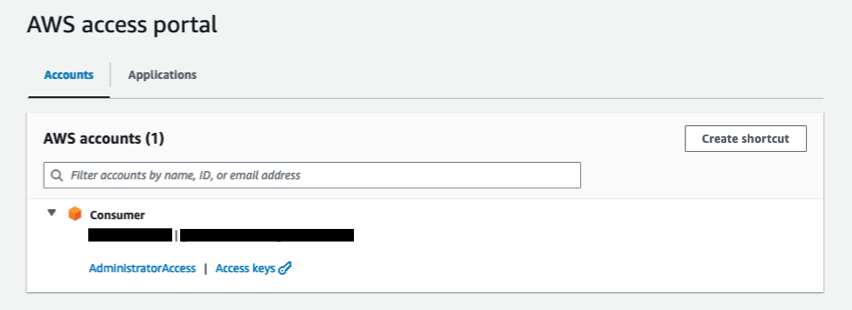
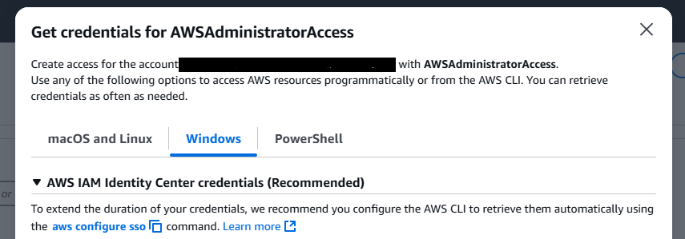
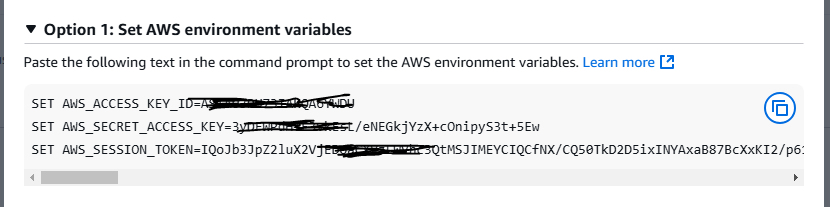
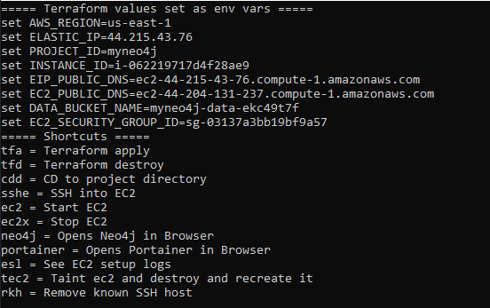
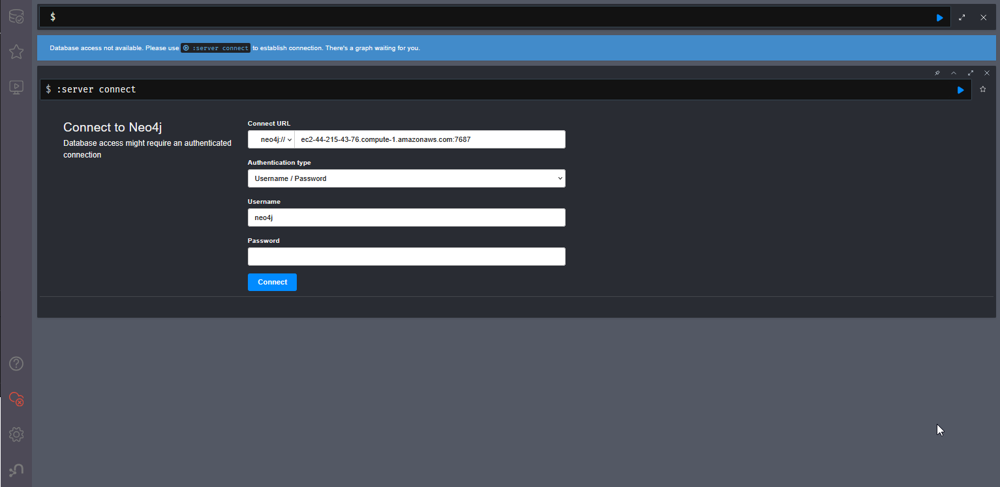

# my-neo4j: Workbench
Neo4j Enterprise Platform on AWS. Deploy a Neo4j Enterprise for individual use and rapid experimentation. Includes Neo4j Enterprise Evaluation version and essential tools like Portainer for managing the docker container images. Perfect for Graph Database enthusiasts seeking a quick, secure personal sandbox.

## Assumptions and pre-requisites
- You are using Windows machine
- You have access to an AWS account
- You are using us-east-1 region

## Design principles
- Keep cost lowest
- KISS - Keep it simple, stupid 
- Scalability and performance are not primary focus. Primary focus is to get things done quickly.
- Security is tight. But only as much required. (Ex: using dummy certs to enable HTTPS)

## What will be installed?
- An EC2 will be created and following softwares will be installed in it:
    - Neo4j Enterprise Edition with Evaluation License (30-Day Trial)
    - Portainer (Web based Docker management)
    - Caddy (reverse proxy and authetication server for Portainer)

## Why should I use this?
- Terraform is leveraged for east deployment of a Neo4j Enterprise instance.
- You have your own instance of Neo4j for your usage. 
- Best use of your AWS account to learn and experiment with a popular Graph DB.

## SETUP GUIDE
### Step 1 Clone this project
- Open cmd window and execute:
```bat
git clone https://github.com/YangKuoshih/Launch-Neo4j-With-Terraform-and-Portainer.git
cd Launch-Neo4j-With-Terraform-and-Portainer
```
### Step 2 Install Terraform
- After cloning the project files from Github go to where you cloned the project folder.
- Run cd scripts
- In cmd run install-terraform.bat 

### Step 3 Install Git for Windows
- Download and install from:  
https://git-scm.com/downloads/win

### Step 4 Install AWS CLI for Windows. Follow:
https://docs.aws.amazon.com/cli/latest/userguide/getting-started-install.html

### Step 5 Login to AWS
- Either set the AWS credentials env vars
- OR, setup profile and set AWS_DEFAULT_PROFILE
- Ensure env var AWS_REGION is set
- Note that your credentials and config files are in .aws folder in your HOME folder.
    - If you do not have this folder or files, you should do ``aws configure``, or create them manually.
#### How to get credentials:
- If you are using AWS Access Portal, after login, you will see screen like (Click on your name):  

- Click on "Acces keys", then go to Windows tab:  



- Go to Options 1 and copy credentials by clicking the blue icon on the right: 



- Go back to the cmd window and paste it and hit Enter.
- Better way to login is to use AWS Profile. See guide here: https://docs.aws.amazon.com/cli/v1/userguide/cli-configure-files.html

### Step 6 Go to your terraform folder in the project file and initialize and apply terraform
```bat
cd terraform  
terraform init  
terraform apply  
```
- Check the plan and when ask for Enter a value, enter yes, hit Enter key
- This may take a few min when you run first time

### Step 7 If you like to use the command line to launch the application
- Open cmd window, if not already open.
- Make sure you do one of the following:
    - Set AWS_DEFAULT_PROFILE
    - Set AWS_ACCESS_KEY_ID, AWS_SECRET_ACCESS_KEY and AWS_SESSION_TOKEN environment variable. 
- Cd to the project folder (cd Launch-Neo4j-With-Terraform-and-Portainer)
- Run following command
```bat
scripts\create-launcher.bat
```
- "launcher.bat" file is created in local folder.
- Windows Explorer is opened.
- Double click "launcher.bat" file.
- NOTE: If you use AWS_DEFAULT_PROFILE you have create launcher only once. If you use AWS_ACCESS_KEY_ID etc. env vars, you have to create launcher everytime you login.  



### Step 8 User Launcher to Open Neo4j
- You will be admin for this instance.
- First time you use username 'neo4j' 
- password 'admin'



### CONGRATULATIONS! At this point the setup is done. Load data and have fun exploring Neo4j!

#### Below are some common cypher queries to use during your exploration.

| **Purpose**                         | **Cypher Query**                                                                                   | **Notes**                                                                 |
|------------------------------------|-----------------------------------------------------------------------------------------------------|---------------------------------------------------------------------------|
| Get all nodes                      | `MATCH (n) RETURN n LIMIT 100`                                                                      | Visualize all node types                                                  |
| Get all relationships              | `MATCH ()-[r]->() RETURN r LIMIT 100`                                                               | Shows all relationships                                                   |
| Get all nodes & relationships      | `MATCH (n)-[r]->(m) RETURN n, r, m LIMIT 100`                                                       | Full subgraph view                                                        |
| Get node labels                    | `CALL db.labels()`                                                                                  | Shows all types of nodes                                                  |
| Get relationship types             | `CALL db.relationshipTypes()`                                                                       | List of all relationship types                                            |
| Count all nodes                    | `MATCH (n) RETURN count(n)`                                                                         | Useful sanity check                                                       |
| Count nodes by label               | `MATCH (n:Transaction) RETURN count(n)`                                                             | Replace `Transaction` with your label                                    |
| Find a node by property            | `MATCH (t:Transaction {id: "TX123456"}) RETURN t`                                                   | Filter by property                                                        |
| Create a node                      | `CREATE (p:Person {name: "Alice", age: 30})`                                                        | Manual node creation                                                      |
| Create a relationship              | `MATCH (a:Person {name: "Alice"}), (b:Person {name: "Bob"}) MERGE (a)-[:FRIENDS_WITH]->(b)`        | Connects two existing nodes                                               |
| Delete a node and its relationships| `MATCH (n:Person {name: "Alice"}) DETACH DELETE n`                                                  | Use `DETACH` to delete with relationships                                |
| Show database name in use          | `:dbinfo`                                                                                           | Neo4j Browser only                                                        |
| Show all databases                 | `SHOW DATABASES`                                                                                    | Useful in multi-db setups                                                 |
| Switch to another database         | `:use your_database_name`                                                                           | Neo4j Browser only                                                        |
| List all properties of a node      | `MATCH (n) RETURN keys(n) LIMIT 1`                                                                  | See field names                                                           |
| Match pattern with relationship    | `MATCH (c:Counterparty)-[r]->(t:Transaction) RETURN c, r, t LIMIT 10`                               | Shows subgraph of connected data                                          |
| Group relationships by type        | `MATCH ()-[r]->() RETURN type(r) AS relType, count(*) AS freq ORDER BY freq DESC`                  | Insight into structure                                                    |
| Sample a single node per label     | `CALL db.labels() YIELD label CALL { WITH label MATCH (n:\` + label + \`) RETURN n LIMIT 1 } RETURN n` | One example per label                                                    |
## Q&A
1. Q: What is Neo4j?
A: Neo4j is a high-performance, graph-based NoSQL database that uses a property graph model to store data. It excels in handling complex relationships and is ideal for applications that require flexible, interconnected data structures.

2. Q: How does Neo4j store data?
A: Neo4j stores data as nodes, relationships, and properties. Nodes represent entities, relationships connect these nodes, and properties provide additional information about both nodes and relationships.

3. Q: What is the Bolt protocol?
A: Bolt is Neo4j’s native binary protocol designed for efficient, low-latency communication between Neo4j and its clients. It supports both secure and non-secure connections.

4. Q: How do I connect to Neo4j using Bolt?
A: You connect using a URL in the format bolt://<host>:7687 for an unsecured connection, or bolt+s://<host>:7687 if TLS is enabled for secure communication.

5. Q: How can I secure connections to Neo4j?
A: You can secure Neo4j by enabling TLS for both the HTTP (7474) and Bolt (7687) connectors. This can be done by setting the appropriate configuration (e.g., dbms.connector.bolt.tls_level=REQUIRED) or via environment variables in your Docker Compose file.

6. Q: How does Neo4j handle transactions?
A: Neo4j supports full ACID-compliant transactions, ensuring data consistency and reliability even in complex graph operations.

7. Q: What are some best practices for query performance in Neo4j?
A: Use indexes and constraints to speed up queries, profile and optimize your Cypher queries, and design your data model to efficiently capture your domain relationships.

8. Q: How do I monitor and troubleshoot Neo4j?
A: Monitor Neo4j using its built-in logging and metrics, and use tools like the Neo4j Browser or third-party monitoring solutions to analyze query performance and system health.

9. Q: What are the available drivers for Neo4j?
A: Neo4j provides official drivers for several languages including Java, Python, JavaScript, .NET, and more, allowing you to integrate it seamlessly with your application stack.

10. Q: How do I scale Neo4j Enterprise?
A: Neo4j Enterprise supports clustering for high availability and horizontal scaling, along with advanced security and monitoring features that help manage larger, more complex deployments.

11. Q: How can I perform backups in Neo4j?
A: You can use Neo4j’s built-in backup utilities for both online and offline backups, and consider setting up automated backup scripts to ensure your data is safely stored.

12. Q: How do I integrate Neo4j into my application?
A: You can integrate Neo4j by using its REST API or one of its native Bolt drivers. The choice of driver depends on your application’s programming language and architecture, making it flexible for a variety of use cases.

## TODO:

Create a controller front end to access Neo4j and Portainer.
